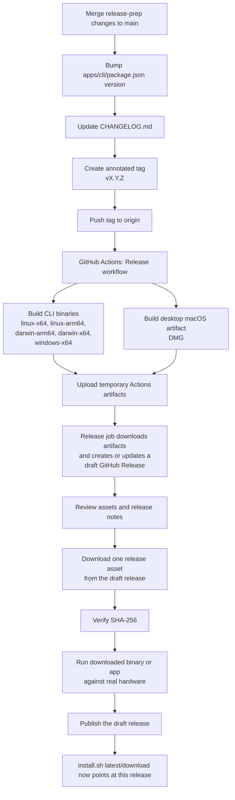

# Release Process

Maintainer-facing notes for cutting and publishing a release of `axon`
plus the experimental macOS desktop app artifact.

`INSTALL.md` is for end users. This document is for the person shipping
the binaries.

## What a "release" means in this repo

There are four distinct pieces:

1. A **git tag** such as `v1.2.1`
2. A **GitHub Actions release workflow run**
3. A **draft GitHub Release** associated with that tag
4. The **published GitHub Release** that end users see as the latest release

Those are related, but they are not the same object.

## Lifecycle



## Where the mechanics live

- Release workflow: [./.github/workflows/release.yml](.github/workflows/release.yml)
- Binary build script: [./scripts/build-release.sh](scripts/build-release.sh)
- Installer: [./scripts/install.sh](scripts/install.sh)
- User install docs: [./docs/INSTALL.md](docs/INSTALL.md)
- Release notes source: [./CHANGELOG.md](CHANGELOG.md)

## Standard release checklist

1. Make sure `main` is the intended release commit and CI is green.
2. Update [apps/cli/package.json](apps/cli/package.json) to the release version.
   The desktop app bundle version is derived from that file, so there is
   no second desktop version to bump manually.
3. Update [CHANGELOG.md](CHANGELOG.md) with the dated release entry.
4. Create and push the tag:

   ```bash
   git checkout main
   git pull --ff-only
   git tag -a v1.2.1 -m "v1.2.1"
   git push origin v1.2.1
   ```

5. Watch the workflow:

   ```bash
   gh run list --workflow Release --limit 5
   gh run watch <run-id> --exit-status
   ```

6. Inspect the draft release:

   ```bash
   gh release view v1.2.1
   gh release view v1.2.1 --json isDraft,url,assets,body
   ```

7. Confirm the draft has:
   - all expected assets
   - `install.sh`
   - the experimental macOS desktop DMG
   - release notes that match the corresponding `CHANGELOG.md` entry
   - the project-story link to `docs/the-adventure.md`

8. Download one asset from the **release page**, verify its checksum,
   and run it against real hardware. This is intentionally not the same
   thing as running a locally built binary.

9. Publish the draft release:

   ```bash
   gh release edit v1.2.1 --draft=false
   ```

10. Verify the public page:

    ```bash
   gh release view v1.2.1 --json isDraft,url,publishedAt
    ```

## Rerunning a release for an existing tag

If the workflow logic is fixed after the tag already exists, do **not**
cut a fake new version just to re-run the pipeline.

Use the manual dispatch path against the existing tag:

```bash
gh workflow run Release --ref main -f tag=v1.2.1
```

That asks the workflow to rebuild and recreate or update the draft
release for the existing tag.

## Draft-release behavior that looks odd but is normal

While the release is still a draft, GitHub may expose it under an
opaque URL segment like `untagged-<random>`. That does **not** mean the
release lost its tag. Check the actual tag association with:

```bash
gh release view v1.2.1 --json tagName,isDraft,url
```

Once published, the public release path should resolve normally under
`/releases/tag/vX.Y.Z`.

## What the release workflow actually does

The release workflow has three jobs:

1. `build`
   - builds the standalone binaries on the appropriate runners
   - uploads them as temporary GitHub Actions artifacts

2. `build-desktop-macos`
   - builds the experimental desktop app on `macos-14`
   - packages the experimental macOS DMG
   - normalizes the release filenames
   - uploads them as temporary GitHub Actions artifacts

3. `release`
   - downloads those temporary artifacts
   - flattens them into one directory
   - adds `install.sh`
   - verifies the full expected asset set is present
   - creates or updates a **draft** GitHub Release for the target tag

Important distinction:

- **Actions artifacts** are temporary job outputs
- **Release assets** are the files attached to the GitHub release page

End users only care about the release assets.

## Current release asset set

The release currently publishes:

- `axon-darwin-arm64`
- `axon-darwin-x64`
- `axon-linux-arm64`
- `axon-linux-x64`
- `axon-windows-x64.exe`
- matching `.sha256` files
- `install.sh`
- `Axon-Servo-Programmer-macos-arm64.dmg`

The desktop artifacts are intentionally macOS-only for now. Windows and
Linux desktop packaging are out of scope for the current release path.

## Native HID packaging note

The standalone binaries intentionally embed the platform-specific
`node-hid` N-API prebuild selected by
[apps/cli/src/driver/nodehid.ts](apps/cli/src/driver/nodehid.ts).

That file exists for a specific reason: Bun standalone executables can
embed `.node` addons when they are required directly, but the stock
`node-hid` JS loader resolves the addon through `pkg-prebuilds` and a
source-tree-relative `__dirname`. In a compiled release binary that
turns into a build-machine path leak and breaks HID on other machines.

Do not "simplify" this by switching the runtime back to:

- `import HID from "node-hid"`
- `createRequire(import.meta.url)` plus relative `.node` paths
- `pkg-prebuilds`-driven addon lookup inside the compiled binary

If the packaging model changes later, revalidate the full release path:

1. build from a clean checkout
2. run the produced binary from outside that checkout
3. download the release asset from GitHub Releases
4. run that downloaded asset against real hardware

## How the installed command becomes just `axon`

The release assets are platform-specific:

- `axon-darwin-arm64`
- `axon-darwin-x64`
- `axon-linux-x64`
- `axon-linux-arm64`
- `axon-windows-x64.exe`

But the installer deliberately installs the selected asset under a
stable final name:

```bash
target_path="${install_dir%/}/axon"
install -m 0755 "${binary_path}" "${target_path}"
```

That logic lives in [./scripts/install.sh](scripts/install.sh).

So:

- the **downloaded asset name** is platform-specific
- the **installed command name** is `axon`

For manual installs, the user performs the same aliasing step by moving
or renaming the downloaded asset to `axon` on their `PATH`.

## macOS signing: current state vs future state

The current release workflow ad-hoc signs macOS binaries as part of the
release build and verifies them with `codesign --verify --verbose=4`
before upload.

That is enough to ensure the shipped binary has a valid embedded code
signature blob and avoids the "broken signature" failure mode.

It is **not** the same as a proper public macOS distribution setup.

- **Current**: ad-hoc signing for binary integrity and loader sanity
- **Future**: Developer ID signing and notarization for a smoother end-user
  trust path

## macOS validation note

For macOS specifically, do not assume "local standalone build runs" is
enough. The release artifact downloaded from GitHub is the real user
path and may behave differently under Gatekeeper or other execution
policy checks.

That is why the checklist explicitly includes:

1. download from the draft release
2. verify checksum
3. run that downloaded binary on real hardware

## Suggested release-note shape

Keep release notes aligned with [CHANGELOG.md](CHANGELOG.md):

- short summary
- link to `docs/the-adventure.md`
- install section
- `Added`
- `Changed`
- `Removed`
- `Fixed`
- `Security`

This keeps the GitHub release page and the repo changelog in sync.
